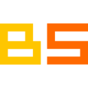

# BlokScript License

## Language & Interpreter Source Code License
The BlokScript source code for the language and interpreter is free, open source software given to the community and world and licensed under [The GNU General Public License Version 3 (GPLv3)](https://www.gnu.org/licenses/gpl-3.0.en.html).  You can read the license in the source code reporsitory [here](https://github.com/cwses1/blokscript).  This includes the C#, grammar code, build scripts, project files for Visual Studio 2022, project files for Visual Studio Code, and any markdown files you find in the repository.

Other assets, such as binary files and logos, are not licensed under GPLv3 and are the property of their respective owners.

## This Website's Source Code License

This [website's source code](https://github.com/cwses1/blokscript-dot-com) (www.blokscript.com) is free, open source software given to the community and world and licensed under [The GNU General Public License Version 3 (GPLv3)](https://www.gnu.org/licenses/gpl-3.0.en.html).  You can read the license in the [source code repository](https://github.com/cwses1/blokscript-dot-com).  This includes any Markdown files, XML files, and build scripts you find in the repository.

Other assets, such as binary files and logos, are not licensed under GPLv3 and are the property of their respective owners.

## BlokScript Image License

The BlokScript image assets (logo, text, favicon images) are licensed under [CC BY-SA 4.0 Deed Attribution-ShareAlike 4.0 International](https://creativecommons.org/licenses/by-sa/4.0/).  If you use these images anywhere, please give us credit and link to this site's home page at [https://www.blokscript.com](https://www.blokscript.com).  For your convenience, these images are listed below.

**BlokScript Logo & Text**

**BlokScript Logo**

**BlokScript Text**

**BlokScript Favicon 128**

**BlokScript Favicon 64**

**BlokScript Favicon 32**

**BlokScript Favicon 16**

