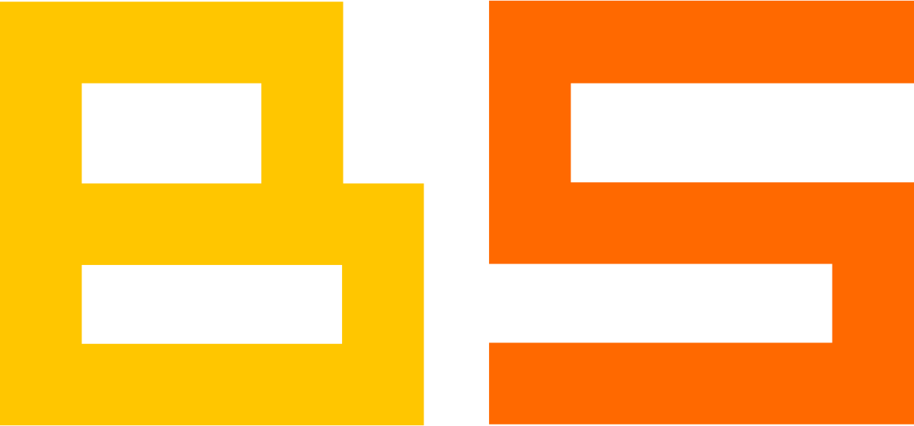

# License

## Code
The BlokScript code is free, open source software licensed under [The GNU General Public License Version 3 (GPLv3)](https://www.gnu.org/licenses/gpl-3.0.en.html).

Other assets, such as binary files and logos, are not licensed under GPLv3 and are the property of their respective owners.

## BlokScript Image License

The BlokScript image assets (logo, text, favicon images) are licensed under [CC BY-SA 4.0 Deed Attribution-ShareAlike 4.0 International](https://creativecommons.org/licenses/by-sa/4.0/).  If you use these images anywhere, please give us credit and link to this site's home page at [https://www.blokscript.com](https://www.blokscript.com).  For your convenience, these images are listed below.

**BlokScript Logo & Text**

**BlokScript Logo**

**BlokScript Text**

**BlokScript Favicon 128**

**BlokScript Favicon 64**

**BlokScript Favicon 32**

**BlokScript Favicon 16**

