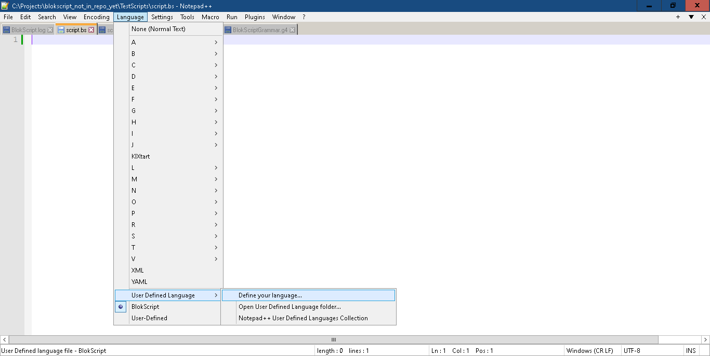

# BlokScript Text Editor Support

## [Notepad++](https://notepad-plus-plus.org/)

To get syntax highlighting in Notepad++, follow these steps to import the BlokScript User Defined Language.  

1. Download the [BlokScript.xml](BlokScript.xml) language definition file for Notepad++.

1. Notepad++ Main Menu: `Language` > `User Defined Language` > `Define your language...`

1. Import Button (Top Left)
1. Select `BlokScript.xml`.

You can run scripts directly from Notepad++ using NppExec.  Here are some script samples.

Execute selected text:

	cd C:\Projects\TestScripts
	blokscript -s "$(SELECTED_TEXT)"

Execute current file:

	cd C:\Projects\TestScripts
	blokscript -f "$(FULL_CURRENT_PATH)"

## Other Text Editors & IDEs

Eventually we'll have support for more text editors and IDEs. The best way to support syntax highlighting and completion is to incorporate the grammar, which can be found in the BlokScript source code on GitHub:

[BlokScript Grammar File](https://github.com/cwses1/blokscript/blob/main/Grammar_BuildScripts/BlokScriptGrammar.g4)

The grammar is an ANTLR4 grammar.
